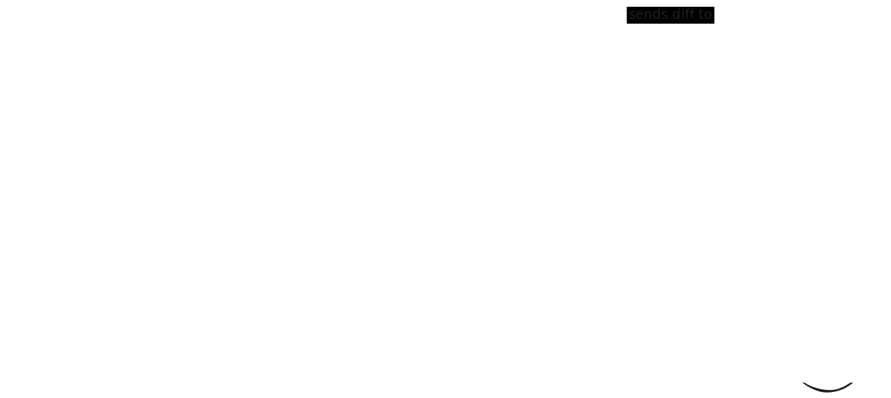

## Overview
This repository contains a Go-based data processing solution designed to demonstrate real-world integration and event-driven architecture: a **Forwarder** service retrieves partner statistics from an external **Reporter** API, **normalizes** and streams them to a **Kafka** topic, while a **Diff-Calculator** service consumes these events, compares them with previous records in an external datastore, emits any detected changes as diff events to another Kafka topic, and updates the stored state accordingly.

### Architecture


## Setup
### Start Infrastructure
```bash
docker-compose up -d
```
This launches Kafka (with UI at http://localhost:8040/), Reporter, and Redis.

### Install and tidy dependencies for both services:
```bash
make tidy
```
This will run `go mod tidy` in both the `forwarder` and `diff-calculator` folders.

## Running the Services
Use the provided Makefile for all main commands.
- Run the Forwarder:
    ```bash
    make run-forwarder
    ```

- Run the Diff-Calculator:
    ```bash
    make run-diff-calculator
    ```

- Run both services:
    ```bash
    make run-apps
    ```

## Testing
- Test Forwarder:
    ```bash
    make test-forwarder
    ```

- Test Diff-Calculator:
    ```bash
    make test-diff-calculator
    ```

- Test both:
    ```bash
    make test
    ```
